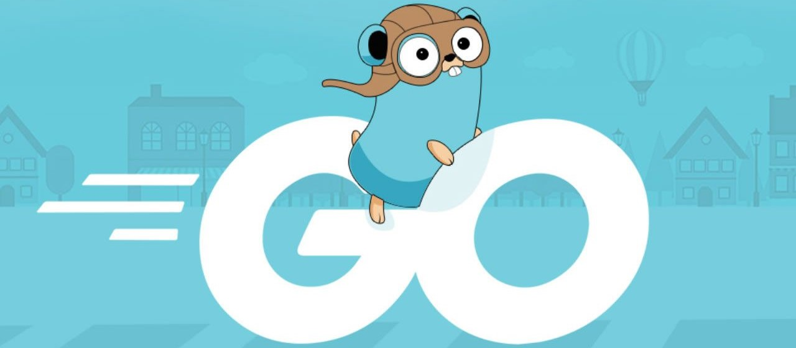

# A Tour of Go: Your Comprehensive Guide to Learning Go Lang  



Welcome to **A Tour of Go**, a comprehensive Git repository designed to help beginners and intermediate learners understand Go Lang in a clear and structured way. This repository offers detailed explanations, real-world examples, coding exercises, and visual aids to enhance your learning experience without the need for paid courses.

---

## Table of Contents 📚
- [Introduction](#introduction)
- [Repository Structure](#repository-structure)
- [Getting Started](#getting-started)
- [Learning Path](#learning-path)
- [Contributing](#contributing)
- [Resources](#resources)
- [License](#license)

---

## Introduction 🚀

Go Lang, also known as Golang, is an open-source programming language designed for simplicity, efficiency, and ease of use. Whether you're new to programming or transitioning from another language, this repository will guide you through essential concepts and practical applications of Go.

> **Note:** Make sure to install Go before starting. Refer to the [Go installation guide](https://golang.org/doc/install).

## Repository Structure

The repository is organized into the following main sections:

| Section                              | Description                                              |
|--------------------------------------|----------------------------------------------------------|
| **01-Welcome**                       | Introduction to Go and basic setup instructions.        |
| **02-Packages-Variables-Functions**  | Understanding packages, variables, and functions.       |
| **03-Flow-Control-Statements**       | Learning about control flow in Go (if, switch, for, etc.).|
| **04-More-Types**                    | Exploring different data types, including arrays, slices, maps, and structs. |
| **05-Methods-and-Interfaces**        | Introduction to methods and interfaces in Go.           |
| **06-Generics**                      | Overview of generics and their usage in Go.             |
| **07-Concurrency**                   | Understanding concurrency and parallelism in Go.        |
| **08-Exercises**                     | Practice exercises to reinforce learning.               |
| **Diagrams**                         | Visual representations of key concepts.                 |

## Getting Started 🌟

To get started, follow these steps:

1. **Clone the Repository**
   ```bash
   git clone https://github.com/yourusername/a-tour-of-go.git
   cd a-tour-of-go

2. **Prerequisites**
   - Install [Go](https://go.dev/doc/install#:~:text=Download%20and%20install%20Go%20quickly%20with%20the%20steps%20described%20here.) on your machine.
   - Familiarity with basic programming concepts (variables, functions, etc.) is beneficial but not required.

3. **Explore the file**
   - Navigate through the folders to explore different topics.
   - Open the README.md files in each section for detailed explanations and usage instructions.

4. **Try out the code**
   - Each section contains example code files. Feel free to run, modify, and experiment with them to deepen your understanding.

## Learning Path🛤️
We recommend following the sections in order, as each topic builds on the previous ones. However, you can also explore specific areas based on your interests.

## Contributing🤝
We welcome contributions! If you'd like to help improve this repository, please follow these steps:
   - Fork the repository.
   - Create a new branch for your feature or fix.
   - Commit your changes.
   - Push to the branch and create a pull request.
Your contributions can help make this repository an even better resource for learners!

## Resources📚
For additional learning, check out these resources:
- [Offical Go Documentation](https://golang.org/doc/)
- [Go by Example](https://gobyexample.com/)
- [Effective Go](https://go.dev/doc/effective_go)

## License📜
This project is licensed under the MIT License. See the [LICENSE](LICENSE) file for more details.


𝗧𝗵𝗮𝗻𝗸 𝘆𝗼𝘂 𝗳𝗼𝗿 𝗰𝗵𝗲𝗰𝗸𝗶𝗻𝗴 𝗼𝘂𝘁 𝗔 𝗧𝗼𝘂𝗿 𝗼𝗳 𝗚𝗼! 𝗪𝗲 𝗵𝗼𝗽𝗲 𝘆𝗼𝘂 𝗳𝗶𝗻𝗱 𝘁𝗵𝗶𝘀 𝗿𝗲𝗽𝗼𝘀𝗶𝘁𝗼𝗿𝘆 𝗵𝗲𝗹𝗽𝗳𝘂𝗹 𝗶𝗻 𝘆𝗼𝘂𝗿 𝗷𝗼𝘂𝗿𝗻𝗲𝘆 𝘁𝗼 𝗺𝗮𝘀𝘁𝗲𝗿𝗶𝗻𝗴 𝗚𝗼 𝗟𝗮𝗻𝗴. 𝗛𝗮𝗽𝗽𝘆 𝗰𝗼𝗱𝗶𝗻𝗴! 🎉
